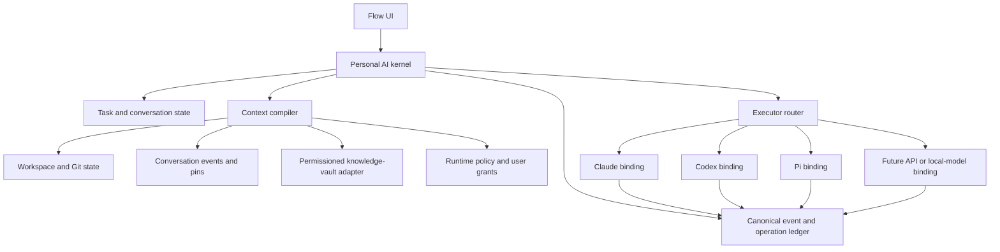
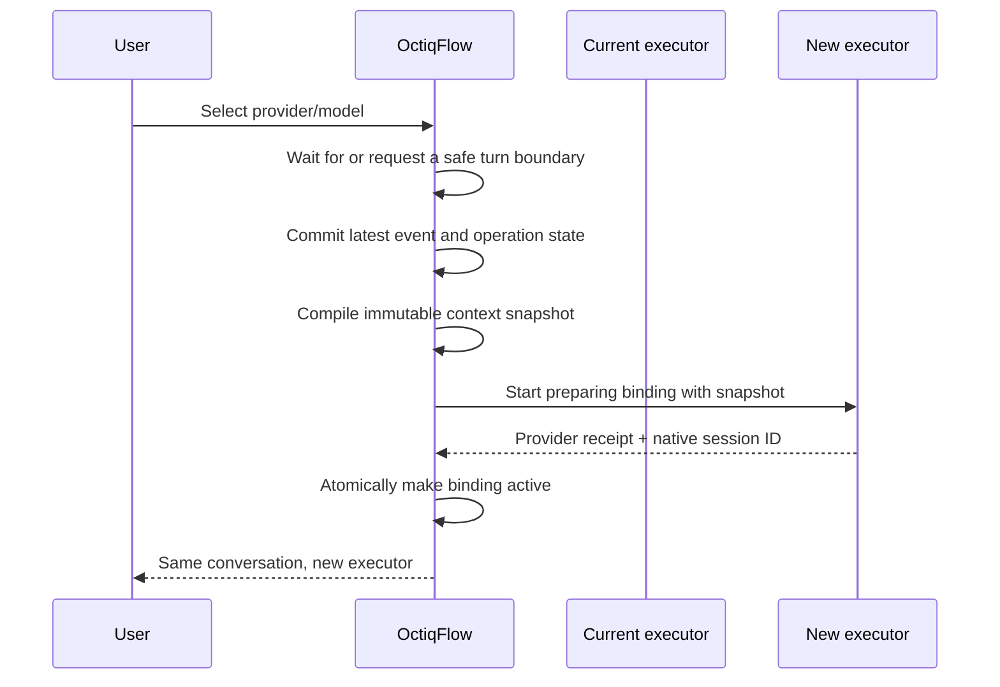

# OctiqFlow Personal AI OS — implementation design

Status: proposed  
Date: 2026-09-18  
Scope: evolve the existing OctiqFlow chat workbench; do not restore the removed
OctiqOS portal or its PostgreSQL control plane.

## Product definition

OctiqFlow becomes a local-first Personal AI OS when the durable identity of the
work belongs to OctiqFlow rather than to Claude, Codex, Pi, or any one model.

The model is a replaceable executor. OctiqFlow owns:

- the conversation and task identity;
- the current objective, constraints, decisions, open questions, and evidence;
- the user's explicit context sources and access grants;
- the delivery and side-effect ledger;
- the provider/model bindings that have worked on the conversation;
- the immutable context snapshot used to start or resume each executor.

This is the central product promise:

> Switching intelligence must not switch identity, lose the task, or replay an
> uncertain action.

It does not promise that two models have the same hidden reasoning or native
session format. Continuity comes from explicit, inspectable state owned by
OctiqFlow.

## Why the current architecture is not there yet

OctiqFlow already has several correct foundations:

- `src-tauri/src/agent_provider.rs` isolates provider command and stream
  differences behind `AgentProvider`.
- `src-tauri/src/transcript.rs` records events before broadcasting them.
- `src-tauri/src/chat_index.rs` keeps server-owned conversation metadata.
- canonical user-turn IDs and delivery states distinguish queued, dispatched,
  acknowledged, failed, and uncertain delivery.
- same-provider model changes can resume the existing provider session.
- profiles, permissions, pins, previews, questions, and project workspaces are
  already first-class host concepts.

The remaining coupling is structural:

1. A conversation has one `session_id` and one `model_id` in `ChatMeta`.
2. `StartContext` is kept only in `ChatManager.starts`; a backend restart loses
   the model, effort, access, workspace, extra folders, and provider-native
   session needed for host-driven resume.
3. The browser opens a new conversation when the provider changes because a
   Claude session ID cannot be resumed by Codex and vice versa.
4. The durable transcript is provider-shaped raw output. It is an audit log,
   not yet a compact provider-neutral working state.
5. Context is mostly whatever the selected CLI reconstructs from its native
   session plus the files it can see. OctiqFlow does not compile a bounded,
   attributable context package.
6. Queues and active processes are organised around the current provider
   process. A Personal AI OS needs one canonical conversation queue whose
   executor may change.

## Design principles

1. **Canonical state is provider-neutral.** Native provider sessions are useful
   caches, never the only copy of the work.
2. **Raw history is append-only; summaries are derived.** A bad summary can be
   rebuilt without losing evidence.
3. **Context is compiled, not dumped.** Every included source has a reason,
   scope, trust level, digest, and token cost.
4. **Switch only at a safe boundary.** A model switch never silently interrupts
   or replays an uncertain external action.
5. **Failure is recoverable.** A failed new provider binding leaves the previous
   binding and canonical queue intact.
6. **Local-first and inspectable.** The authoritative records remain ordinary
   files in the active OctiqFlow profile. Any future search database is a
   rebuildable index.
7. **Personal memory is permissioned.** A configured knowledge vault is not a
   folder that every model may crawl.
8. **Human corrections outrank inferred memory.** An explicit correction is
   retained with provenance and cannot be silently overwritten by a later
   summary.
9. **No second operating system UI.** The OS layer grows underneath the current
   Flow conversation, workspace, Attention, Files, and Preview surfaces.

## Target architecture



The provider adapter remains. A new Personal AI kernel sits above it and owns
the lifecycle that is currently split between the browser and `ChatManager`.

## Canonical data model

The names below describe contracts, not required Rust type names.

### Conversation record

```text
ConversationRecord
  id
  project_id
  title
  created_at / updated_at
  active_binding_id?
  latest_snapshot_id?
  state_version
  status: active | paused | archived | deleted
```

`session_id` and `model_id` no longer belong directly to the conversation. They
belong to one of its provider bindings.

### Provider binding

```text
ProviderBinding
  id
  conversation_id
  provider
  model
  effort
  access
  native_session_id?
  based_on_snapshot_id
  last_synced_snapshot_id
  status: preparing | active | idle | stale | failed | closed
  created_at / last_used_at
  failure?
```

A conversation may retain several bindings. Switching back to an older binding
does not assume it knows what happened while another model was active. The
kernel first sends a delta from `last_synced_snapshot_id` to the current
snapshot.

### Durable run manifest

```text
RunManifest
  conversation_id
  workspace + extra folders
  selected provider/model/effort/access
  enabled host tools and grants
  active seat configuration
  current provider binding
  last acknowledged turn
  schema_version
```

This replaces the in-memory-only ownership of `StartContext`. It is written
atomically before a process starts and updated when the provider announces its
native session ID.

### Context snapshot

```text
ContextSnapshot
  id
  conversation_id
  parent_id?
  trigger_turn_id
  objective
  task_state
  constraints[]
  confirmed_decisions[]
  open_questions[]
  pending_operations[]
  relevant_artifacts[]
  recent_turn_refs[]
  source_refs[]
  token_estimate
  compiler_version
  content_hash
  created_at
```

Snapshots are immutable. They store compact working state and references to
evidence, not a second full transcript.

### Context source reference

```text
ContextSourceRef
  kind: runtime | user_turn | project_rule | project_state | knowledge | file
  locator
  heading_or_range?
  digest
  trust: authoritative | confirmed | observed | inferred | untrusted
  sensitivity
  scope
  included_reason
  retrieved_at
```

The digest detects stale source material. The trust field prevents a clipped
article, old brainstorm, or retrieved web page from being treated as an active
instruction.

### Operation record

```text
OperationRecord
  id
  turn_id
  binding_id
  kind
  dedupe_key?
  status: proposed | authorised | started | succeeded | failed | unknown
  target
  evidence_refs[]
  started_at / finished_at?
```

Provider switching never retries an operation in `started` or `unknown` state.
The next executor receives the state and must inspect or ask rather than repeat
the effect.

## Storage layout

Keep the current append-only transcript. Add small atomic manifests and
immutable snapshots under the active profile:

```text
<profile>/
  chats/
    chat_<conversation>.jsonl       existing raw event ledger
    state_<conversation>.json       conversation + run manifest
    bindings_<conversation>.json    provider bindings
    snapshots/<conversation>/
      <snapshot-id>.json
  context/
    grants.json                     source/scope permissions
    project-manifests.json          workspace → context manifest mapping
    cache/                          derived, safe to rebuild
```

Use temporary-file plus rename writes, matching the safe patterns already used
by the chat index. Do not require PostgreSQL for the personal runtime. If full
text or semantic retrieval later needs SQLite, SQLite is a disposable index;
the JSONL, manifests, snapshots, and source Markdown remain authoritative.

This avoids restoring the deleted OctiqOS control plane and avoids making chat
availability depend on a database service.

## Context compiler

For every fresh binding, provider switch, recovery, or explicit context refresh,
the compiler builds one bounded `ContextEnvelope`.

### Input order

1. **Runtime contract** — workspace, time, provider/model, access, approvals,
   available host tools, and hard safety boundaries.
2. **Current task state** — objective, acceptance criteria, status, blockers,
   pending decisions, and unfinished operations.
3. **Explicit user direction** — recent corrections and instructions, retained
   as source-linked facts rather than blended into an anonymous summary.
4. **Recent conversation tail** — a bounded semantic tail, not raw streaming
   deltas or every tool event.
5. **Project truth** — project instructions, current progress, confirmed
   decisions, relevant facts, selected files, and Git state.
6. **Personal memory** — only sources allowed by the project's context manifest
   and the user's vault grants.
7. **On-demand retrieval** — additional sources requested by the executor through
   a scoped host tool.

### Selection policy

- Deterministic sources are selected first: explicit pins, current task state,
  project rules, recent user corrections, and pending operations.
- Keyword/path retrieval comes before embeddings. It is explainable, cheap, and
  sufficient to prove the permission and provenance model.
- Semantic retrieval may be added later as a candidate generator. It never
  bypasses source grants or trust classification.
- Every source has a maximum contribution and the whole envelope has a provider-
  aware token budget.
- When the budget is exceeded, drop low-trust background before constraints,
  decisions, corrections, or pending-operation state.
- The UI exposes what was included, omitted, stale, or conflicting.

### Suggested budget shape

The exact numbers remain configurable, but the priority should be stable:

| Layer | Typical share | May be compressed? |
| --- | ---: | --- |
| Runtime and safety contract | 10% | No |
| Objective, task state, decisions | 25% | Only with source refs |
| Recent conversation | 30% | Older turns only |
| Project truth and working files | 25% | Yes |
| Personal memory and retrieval | 10% | Yes, and may be omitted |

Unused space flows downward. A short task is not padded to fill the window.

### Derived memory rules

- A summary is `inferred` until a user confirmation or authoritative source
  supports it.
- Every extracted decision, constraint, and open question keeps source event
  IDs.
- User corrections create a new item that supersedes the old item; history is
  retained.
- Contradictions are surfaced. The compiler never silently chooses between two
  equally authoritative claims.
- Snapshot generation is deterministic where possible and versioned where it
  uses a model.

## Model and provider switching

### Same conversation, new executor



Rules:

1. If a turn is busy, switching becomes `pending switch`. The user may wait or
   explicitly stop; selecting a model alone does not kill work.
2. The canonical queue belongs to the conversation. A pending prompt is never
   copied into two provider queues.
3. The new binding becomes active only after process start and provider receipt.
   Before that, the previous binding remains the recovery target.
4. A failed start leaves the conversation, prompt, snapshot, and old binding
   intact. The UI shows the failure and offers retry or another executor.
5. Switching back to an older native session first sends a delta capsule for
   everything committed since it last participated.
6. Hidden chain-of-thought is not migrated. Only explicit canonical state,
   messages, tool evidence, and files are transferable.
7. An `unknown` delivery or side effect blocks automatic replay across the
   switch boundary.

### Context bootstrap

Each provider adapter serialises the same envelope using its supported
mechanism:

- system/developer prompt for host rules;
- a clearly marked context capsule for current state;
- provider-native resume only when the binding itself is being resumed;
- a delta capsule when an older binding rejoins;
- source locators available through host tools rather than full-file injection.

This is not one giant generated prompt. It is a typed host contract rendered by
the provider adapter.

## Knowledge-vault boundary

The current vault architecture is already suitable as curated long-term memory:
it has trust tiers, project records, explicit preferences, decisions, progress,
sources, and provenance rules. Replacing it with a vector database would lose
those semantics.

The necessary change is to make OctiqFlow a careful reader and proposer.

### Keep

- the existing raw → incubating → trusted promotion model;
- Markdown as the human-readable source of truth;
- project-scoped preferences and confirmed shared decisions;
- source preservation and explicit links;
- separate human review and engineering-event records.

### Improve

1. **Add one context manifest per active project.** It declares always-eligible,
   on-demand, and excluded sources; scope; sensitivity; and a default budget.
   The manifest stays in the private knowledge system. Repositories never carry
   private vault paths.
2. **Make current project state short.** The current section should be readable
   in about a minute. Historical timelines move to linked notes or logs rather
   than growing forever in the startup document.
3. **Reconcile stale project truth.** Historical OctiqOS records must be marked
   superseded or closed after the code removal; they should remain as history
   but must not enter current context as an active system.
4. **Repair status semantics before using them for retrieval.** A file located
   under `done/` with `status: active` cannot drive an automatic current-work
   view until reconciled.
5. **Add selective metadata, not a vault-wide migration.** Active context
   sources benefit from `scope`, `sensitivity`, `reviewed`, `supersedes`, and
   optional `review_after`. Old notes do not need mass editing.
6. **Separate instructions from knowledge.** Preferences and project rules may
   influence behavior; sources, raw captures, web clips, and brainstorms are
   quoted data even when they contain imperative text.

### Read path

```text
project context manifest
  → allowed source catalog
  → exact/project search
  → ranked candidates
  → trust + freshness + scope checks
  → ContextSourceRef entries
  → bounded context envelope
```

The first version should read files directly and cache digests. It does not need
an Obsidian plugin, a community plugin, or a running Obsidian application.

### Write-back path

Models do not directly promote inferred memory into trusted records.

```text
model proposes memory change
  → OctiqFlow shows target, reason, source, and diff
  → user accepts, edits, or rejects
  → host performs the schema-aware append/update
  → ledger records provenance and outcome
```

Routine project progress written as part of already-authorised work may continue
to follow project policy. Cross-project preferences, personal conclusions, and
promotion into trusted memory require explicit review.

## User experience

### Model picker

- Selecting another model no longer means “new chat”.
- The picker states `Keeps this conversation` for any compatible executor,
  including another provider.
- A busy switch shows `Switch after this turn` and an explicit `Stop and switch`
  action.
- Preparation and failure states are visible; the old executor remains named as
  the fallback until activation succeeds.

### Context inspector

The existing context meter opens an inspector with:

- current objective and task state;
- active provider binding and previous bindings;
- included sources grouped by runtime, conversation, project, and personal;
- token contribution and reason for each source;
- stale, conflicting, excluded, or permission-blocked sources;
- the snapshot hash used for the current executor;
- `Pin for this task`, `Exclude`, `Refresh`, and `Correct` actions.

It must answer “why does this model know this?” and “why did it not receive
that?” without exposing hidden provider reasoning.

### Memory inbox

Do not create a second notes application. Use a small review queue for proposed
memory updates, conflicts, and stale-source warnings. Accepted changes land in
the configured knowledge system; rejected proposals remain in the audit ledger
but do not pollute future context.

## Reliability and security

- Persist the run manifest before spawn and the native session ID immediately
  after it is observed.
- Use schema versions and crash-safe atomic writes.
- Hash snapshots and source digests; never claim a binding used context that
  cannot be identified.
- Keep canonical turn IDs across switches.
- Preserve the current rule: ambiguous delivery is never automatically resent.
- Treat external content and retrieved notes as untrusted unless their source
  type explicitly grants instruction authority.
- Enforce project and vault scope in the host before retrieval, not only in a
  prompt.
- Store grants in the OctiqFlow profile, not in a shared repository.
- Redact secrets from generated context previews while preserving a local source
  reference where authorised.
- Make context caches disposable and clearable without deleting source memory or
  transcripts.

## Delivery plan

Each phase must be independently useful. Do not start with semantic search or a
new visual world.

### Phase 0 — Contracts and fixtures

1. Define the canonical records and schema versions.
2. Add fake persistent-stream and one-shot providers for lifecycle tests.
3. Record golden fixtures for restart, switch, failure, uncertain delivery, and
   switch-back-with-delta.

Acceptance:

- the same canonical fixture renders for every provider adapter;
- operation status cannot move backward or duplicate a terminal event;
- snapshot hashes are stable for identical inputs.

### Phase 1 — Durable runtime manifest

1. Persist the fields currently held only by `StartContext`.
2. Store provider-native sessions as bindings rather than one chat field.
3. Restore host and seat launch state after a backend restart.
4. Keep the existing browser wire shape through a compatibility projection.

Acceptance:

- restart the backend between turns and resume with the same workspace, access,
  model, effort, tools, and native session;
- a torn manifest write leaves the previous valid version readable;
- no existing transcript or chat index needs destructive migration.

### Phase 2 — Canonical working state and context snapshots

1. Build provider-neutral semantic turns from the existing event log.
2. Extract objective, constraints, decisions, open questions, and operations with
   source references.
3. Store immutable snapshots and add a read-only Context inspector.
4. Bound large conversations by snapshot plus recent tail.

Acceptance:

- a large conversation produces a bounded envelope with inspectable sources;
- every derived claim links to transcript evidence or is marked inferred;
- deleting the derived cache and rebuilding produces equivalent state.

### Phase 3 — Cross-provider switching

1. Move the pending queue to conversation ownership.
2. Add preparing/active/failed provider bindings.
3. Bootstrap a new provider from a snapshot in the same conversation.
4. Add delta synchronisation when returning to an older binding.
5. Replace the current new-chat behavior in `App.changeModel`.

Acceptance:

- Codex → Claude → Codex occurs under one conversation URL and transcript;
- the second Codex turn receives the Claude-era delta without replaying an
  already completed tool action;
- launch failure leaves the original binding active;
- a busy switch never silently kills a turn.

### Phase 4 — Permissioned knowledge-vault adapter

1. Add project context manifests and profile-local grants.
2. Implement exact/path/heading retrieval with file digests and trust tiers.
3. Add source inclusion/exclusion controls to the Context inspector.
4. Detect stale and conflicting current-state sources.

Acceptance:

- excluded folders never appear in candidate or final context;
- the UI explains every included vault source;
- changing a source invalidates only affected cached context;
- the system functions while the Obsidian app is closed.

### Phase 5 — Reviewed memory write-back

1. Add typed memory proposals with source evidence.
2. Show schema-aware append/update diffs.
3. Apply accepted changes and record provenance.
4. Support correction and supersession without erasing history.

Acceptance:

- rejecting a proposal has no effect on future context;
- accepting it changes the intended source once and is idempotent;
- raw or inferred content cannot silently promote itself to trusted memory.

### Phase 6 — Routing and graceful fallback

1. Add capability and health metadata to the provider registry.
2. Let the user choose manual, policy-assisted, or fixed-model routing.
3. Offer another executor after startup/quota/provider failure using the same
   committed snapshot.
4. Add evaluations for context retention, leakage, stale facts, and action replay.

Acceptance:

- fallback never sends data beyond the selected grant boundary;
- the reason for routing is visible;
- a provider outage cannot lose canonical task state;
- evaluations fail when a constraint, user correction, or pending operation is
  dropped.

## Recommended first implementation slice

Start with Phase 1 plus the smallest part of Phase 2:

1. introduce `ConversationRuntime` and `ProviderBinding` persistence;
2. migrate `StartContext` into the durable manifest while keeping the in-memory
   cache for speed;
3. write one deterministic context snapshot containing objective, recent
   semantic turns, runtime metadata, and pending delivery/operation state;
4. expose the snapshot through a debug/read-only RPC;
5. prove restart recovery with backend tests.

Do not change the model-picker UX until the durable records and failure tests
exist. Otherwise the UI would promise cross-model continuity before the kernel
can uphold it.

## Explicit non-goals

- restoring the deleted OctiqOS `/os` portal, office world, Secretary, or
  PostgreSQL schema;
- giving models unrestricted access to a personal vault;
- automatically writing every conversation into long-term memory;
- copying entire project histories into every prompt;
- migrating hidden reasoning between providers;
- automatically replaying an ambiguous prompt or side effect;
- installing Obsidian community plugins as a prerequisite;
- making autonomous model routing mandatory.

## Decisions this design recommends

1. OctiqFlow itself becomes the OS kernel; there is no separate OctiqOS portal.
2. Append-only files and immutable snapshots remain authoritative; a database is
   optional derived infrastructure.
3. Conversations contain many provider bindings, not one provider session.
4. Context switching is snapshot-and-delta based, not native-session conversion.
5. The knowledge vault remains curated long-term memory; OctiqFlow owns runtime
   context, permissions, provenance, and retrieval.
6. Deterministic retrieval ships before embeddings.
7. Memory write-back is reviewable and typed.

These choices directly support the desired property: models can be replaced
without replacing the user's working identity or making the system fragile.
