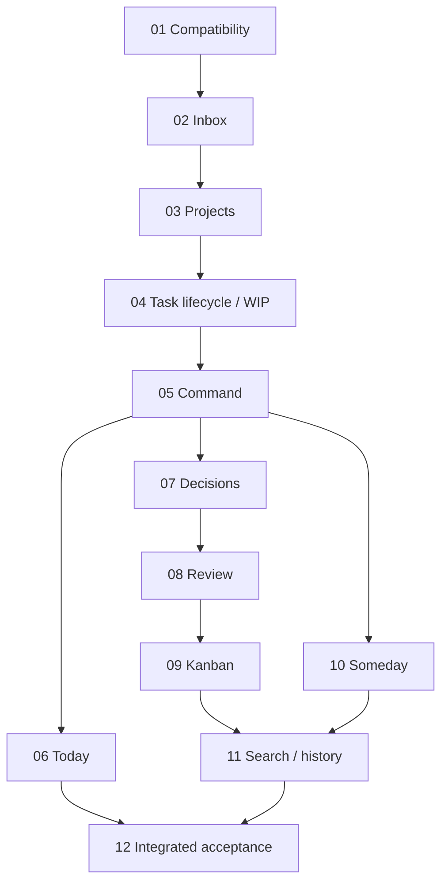

# Personal Command Board — progress

Updated: 2026-09-16
Status: planned; 0 / 12 cards implemented.
Current step: planning complete; next eligible implementation is card 01.

## Ordered execution queue

| Order | Capability | Dependencies | Layers | Category | Sensitivity | State |
| --- | --- | --- | --- | --- | --- | --- |
| 01 | [Preserve existing work and separate task lifecycle from execution](active/01-preserve-work-and-separate-execution.md) | — | both | data-migration | sensitive | Not started |
| 02 | [Capture title-only Inbox ideas and track human or agent owners](active/02-capture-inbox-and-track-owners.md) | 01 | both | implementation | sensitive | Not started |
| 03 | [Manage project commitments, project detail and focus settings](active/03-manage-project-focus-and-settings.md) | 01, 02 | both | implementation | sensitive | Not started |
| 04 | [Promote defined tasks and enforce personal WIP](active/04-promote-tasks-and-enforce-personal-wip.md) | 02, 03 | both | implementation | sensitive | Not started |
| 05 | [Show the global Command dashboard and shared task context](active/05-show-global-command.md) | 04 | both | implementation | sensitive | Not started |
| 06 | [Choose a bounded Today list without changing task state](active/06-choose-bounded-today.md) | 04, 05 | both | implementation | sensitive | Not started |
| 07 | [Resolve decision tasks and preserve a searchable Decision Log](active/07-record-decisions-and-history.md) | 04, 05 | both | implementation | sensitive | Not started |
| 08 | [Review delegated results in batches and apply review backpressure](active/08-review-delegated-results-and-backpressure.md) | 04, 05, 07 | both | implementation | sensitive | Not started |
| 09 | [Move work on a guarded secondary Kanban](active/09-move-work-on-guarded-kanban.md) | 04, 05, 07, 08 | FE | implementation | standard | Not started |
| 10 | [Store and deliberately revisit Someday / Lab ideas](active/10-store-and-revisit-someday-ideas.md) | 02, 04, 05 | both | implementation | sensitive | Not started |
| 11 | [Search all work, combine filters and read activity history](active/11-search-filter-and-read-activity.md) | 03, 04, 07, 08, 09, 10 | both | implementation | sensitive | Not started |
| 12 | [Qualify the complete attention workflow and make Command the default](active/12-qualify-mvp-and-default-command.md) | 01, 02, 03, 04, 05, 06, 07, 08, 09, 10, 11 | both | testing | sensitive | Not started |

## Dependency map

The table is authoritative for all prerequisites; the graph shows the main
chains. Number order is the default execution order. Independent edges do not
authorize parallel agents or concurrent edits to shared world/portal files.

## Milestones

- 01–06: usable local capture/focus/Command/Today loop; not full MVP readiness.
- 07–08: complete decision and delegated-result acceptance loops.
- 09–11: Kanban, Someday, search and readable activity.
- 12: integrated evidence, ten success criteria and default Command entry.

## Confirmed planning decisions

- Personal Active execution cap = 3; independent delegated capacity.
- Review threshold = 5 with admission backpressure and preserved overflow.
- Scope = section 31 MVP plus Today.
- Existing stack and single world task store retained as the implementation plan.
- Weekly Review, proactive notifications and new execution integration deferred.

## Verification status

Planning artifacts only. Validation passed: 12 cards, 51 uniquely assigned L1
scenarios, 23 planned per-layer L2 paths, coverage of all 35 requirement sections,
ordered acyclic dependencies, existing relative links and clean whitespace.
No product build/test result is claimed. The application and runtime behavior
have not been changed by planning.

## Resume instruction

Read `_overview.md`, `plan.md`, this file and
`active/01-preserve-work-and-separate-execution.md`.
Recheck repository instructions and git status, then execute card 01's checklist.
Keep subsequent cards pending until their prerequisites pass.
